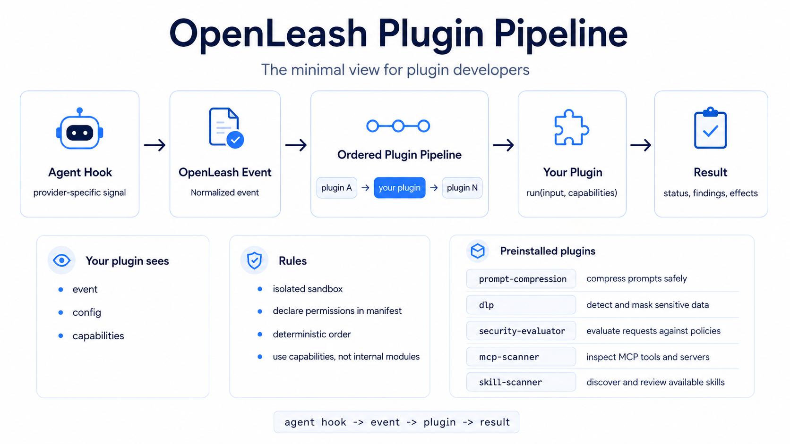

<div align="center">


<p>
  <a href="https://openleash.com"></a>
  <a href="https://docs.openleash.com/reference/plugins"></a>
  
</p>

<h3>Build focused plugins that extend OpenLeash without importing OpenLeash internals.</h3>



</div>

---

## What This Repo Is

This repo contains examples, templates, and first-party OpenLeash plugins.

OpenLeash is an interception layer for AI agents. Agent-specific hooks are normalized into OpenLeash events, then the enabled plugins for that event run in a deterministic pipeline.

```text
agent hook -> desktop relay -> client-api -> event -> ordered plugin pipeline
```

Plugins are contained. They do not import OpenLeash database modules, evaluators, server handlers, or model-key readers. They declare what they need in a manifest and receive stable runtime capabilities from OpenLeash.

---

## Repository Map

```text
plugins/
  prompt-compression/
  dlp/
  security-evaluator/
  mcp-scanner/
  skill-scanner/

examples/
  basic-observer/
  prompt-evaluator/

docs/
  plugin-contract.md
  storage.md
```

---

## What A Plugin Contains

```text
my-plugin/
  README.md
  package.json
  src/
    manifest.ts
    index.ts
```

The manifest is the plugin contract:

- metadata for store/catalog display
- subscribed events
- permissions
- effects
- ordering
- settings schema
- default settings

---

## Minimal Manifest

```ts
export const manifest = {
  id: "acme.prompt-labeler",
  name: "Prompt Labeler",
  version: "1.0.0",
  publisher: "acme",
  runtime: "node",
  entrypoint: "src/index.ts",
  events: ["prompt.beforeSubmit"],
  permissions: ["event:read", "prompt:read", "audit:write", "storage:write"],
  effects: ["observe"],
  ordering: {
    priority: 250,
    after: ["openleash.dlp"]
  },
  configSchema: {
    type: "object",
    additionalProperties: false,
    properties: {
      enabled: { type: "boolean" },
      label: { type: "string" }
    }
  },
  defaultConfig: {
    enabled: true,
    label: "reviewed"
  }
};
```

---

## Minimal Handler

```ts
export async function run(input, capabilities) {
  if (!input.config.enabled) {
    return { status: "skipped", summary: "Disabled." };
  }

  await capabilities.storage.set({
    scope: { sessionId: input.event.sessionId },
    key: "labels/latest",
    value: { label: input.config.label, at: Date.now() },
    ttlSeconds: 86400
  });

  return {
    status: "passed",
    summary: "Prompt labeled.",
    findings: [{
      title: "Prompt label",
      severity: "info",
      summary: input.config.label
    }]
  };
}
```

---

## Events

Use the narrowest event possible:

- `openleash.startup`
- `agent.detected`
- `skill.changed`
- `prompt.beforeSubmit`
- `agent.response`
- `tool.beforeUse`
- `tool.afterUse`
- `session.started`
- `session.ended`

---

## Permissions

Declare only what the plugin needs:

- `event:read`
- `prompt:read`
- `prompt:write`
- `tool:read`
- `decision:write`
- `model:invoke`
- `filesystem:read`
- `filesystem:write`
- `storage:read`
- `storage:write`
- `audit:write`
- `notification:send`

---

## Runtime Capabilities

Capabilities are the stable boundary between plugins and OpenLeash internals.

```ts
await capabilities.prompt.compress({ prompt, level: "standard" });
await capabilities.dlp.inspect({ prompt, action: "mask", categories: ["pii", "keys"] });
await capabilities.security.evaluatePolicies({ request, policies });
await capabilities.notification.send({ title: "Review needed", body: "Risky command held." });
await capabilities.storage.set({ key: "cache/hash", value: { ok: true } });
```

If a plugin needs a new privileged operation, add a narrow capability to the OpenLeash plugin contract. Do not import an internal OpenLeash module as a shortcut.

---

## Plugin Storage

Plugins use OpenLeash-owned, plugin-scoped JSON storage. OpenLeash injects the organization and plugin identity.

```text
organization_id + plugin_id + scope + key
```

The plugin supplies only `scope` and `key`, so one plugin cannot read another plugin's data.

Good key shapes:

- `sessions/<session-id>/summary`
- `heuristics/<user-id>/risk-profile`
- `cache/<hash>`
- `notifications/<dedupe-key>`

---

## First-Party Plugins

These plugins ship preinstalled in OpenLeash and can be used as reference implementations:

- [`plugins/prompt-compression`](plugins/prompt-compression)
- [`plugins/dlp`](plugins/dlp)
- [`plugins/security-evaluator`](plugins/security-evaluator)
- [`plugins/mcp-scanner`](plugins/mcp-scanner)
- [`plugins/skill-scanner`](plugins/skill-scanner)

## Examples

- [`examples/basic-observer`](examples/basic-observer) shows a tiny read-only plugin.
- [`examples/prompt-evaluator`](examples/prompt-evaluator) shows storage, notification, and typed findings.

<div align="center">

### Small plugins. Clear events. No spooky internal imports.

</div>
